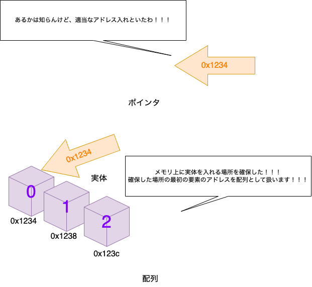

# Cのポインタを理解しよう

## 狙い
ポインタの苦手意識をちょっと減らせる

## プログラムの実行方法
普通にUnix環境やWindows環境で実行してもよい。一応、Ubuntu環境を手軽に用意するためのDockerfileおよびdocker-compose.ymlを作っておいた。以下のコマンドで実行可能である。

```sh
# Dockerコンテナの立ち上げ
$ docker compose up --build -d
# Dockerコンテナでシェル起動
$ docker compose exec c_pointers zsh
# シェルが立ち上がるので、そこで操作
# 終わったら、以下のコマンドでコンテナとイメージを削除
$ docker compose down
```

## ポインタとは

ポインタは、変数のアドレスを格納している。**アドレス=ポインタ、ではなく**、アドレスを格納するための**変数**がポインタである。ポインタも一種の**型**。

<div align="center"></div>

ポインタの実装は以下の通り。ソースコードは、`./src/pointer.c`である。
```c
#include <stdio.h>

/**
 * @brief ポインタを定義して、アドレスを表示するためのプログラム
 *
 * @return int
 */
int main() {
    int *a;
    // 16進数でポインタに格納されているアドレスを表示
    printf("%0x", a);
    return 0;
}
```
実行するとこうなる。アドレスは実行環境によって異なる。
```sh
$ gcc pointer.c -o pointer && ./pointer
f601b90
```

## 普通の変数もアドレスを持っているという話

普通の変数も、もちろんアドレスを持っている。変数`a`のアドレスは、`&a`で表現できる。ソースコードは、`./src/normal_var.c`である。
```c
#include <stdio.h>

/**
 * @brief 普通の変数を定義して、アドレスを表示するためのプログラム
 *
 * @return int
 */
int main() {
    int a;
    // 16進数でアドレスを表示
    printf("%0x", &a);
    return 0;
}
```

```sh
$ gcc normal_var.c -o normal_var && ./normal_var
b4e17c4c
```

## 関数も......？もちろんアドレスを持っている

関数だって**アドレス**を持っている。引数を書かなければ、アドレスが出てくる。ソースコードは、`./src/normal_func.c`である。
```c
#include <stdio.h>

/**
 * @brief 足し算を行う関数
 *
 * @param a
 * @param b
 * @return int
 */
int add(int a, int b) { return a + b; }

/**
 * @brief 普通の関数を定義して、アドレスを表示するためのプログラム
 *
 * @return int
 */
int main() {
    // 16進数でアドレスを表示
    printf("%0x\n", add);
    // 16進数で計算結果を表示
    printf("%0x", add(1, 2));
    return 0;
}
```

```sh
$ gcc normal_func.c -o normal_func && ./normal_func
b359f06
3
```
ちなみに、関数のアドレスを格納するためのポインタを関数ポインタという。


## 配列とポインタは同じだって聞いたのですが......？
### 配列について
配列は、変数が格納される分だけ**メモリの初期化**を行う。例えば、`int a[2]`と書けば、`int`型の32bitの領域が2つ分、つまり64bitを配列`a`のために予約してくれる。ソースコードは`./src/normal_array.c`である。
```c
#include <stdio.h>
/**
* @brief 配列の初期化
*
* @return int
*/
int main() {
    int a[3] = {1, 0, 2};
    printf("%d", a[2]);
    return 0;
}
```
```sh
$ gcc normal_array.c -o normal_array && ./normal_array
2
```

ポインタはアドレスをただただ格納するだけなので、変数がどれだけ格納されるか、なんてわかるわけがない。したがって、`int *a = {0,1,2};`などと書くとSegmentation fault.になる。ソースコードは`./src/ptr_as_array.c`である。
```c
#include <stdio.h>

/**
 * @brief Segmentation faultが起こることを確認しよう。
 *
 * @return int
 */
int main() {
    // a[3]ではなく*aにしてみた
    int *a = {1, 0, 2};
    printf("%d", a[2]);
    return 0;
}
```
```sh
$ gcc ptr_as_array.c -o ptr_as_array && ./ptr_as_array
arr_and_ptr.c: In function 'main':
arr_and_ptr.c:9:15: warning: initialization of 'int *' from 'int' 
makes pointer from integer without a cast [-Wint-conversion]
    9 |     int *a = {1, 0, 2};
      |               ^
arr_and_ptr.c:9:15: note: (near initialization for 'a')
arr_and_ptr.c:9:18: warning: excess elements in scalar initializer
    9 |     int *a = {1, 0, 2};
      |                  ^
arr_and_ptr.c:9:18: note: (near initialization for 'a')
arr_and_ptr.c:9:21: warning: excess elements in scalar initializer
    9 |     int *a = {1, 0, 2};
      |                     ^
arr_and_ptr.c:9:21: note: (near initialization for 'a')
zsh: segmentation fault  "/Path/to/c_pointers/src/""arr_and_ptr"
```
ポインタ変数は初期化せずに使うとメモリ上の適当なアドレスを指す。そこに値を入れようとしたところで、OSから拒否される可能性がある（Segmentation fault）。

## じゃあ配列とポインタって全然違うもの？
そんなことはない。配列は初期化を行なったあと、**要素の先頭のアドレスを保持する**ことで、あたかも複数の値を所持してますよって顔をする。
図にするとこんな感じ。
<div align="center"></div>

一旦配列の値が入る場所を確保してしまえば、そのあとにポインタを使って操作する分にはなんら問題はない。例えば、こんなのは問題にならない。
<div align="center"></div>

ソースコードは、`./src/ptr_and_arr_are_friend.c`である。
```c
#include <stdio.h>

/**
 * @brief 配列とポインタはおともだちです
 *
 * @return int
 */
int main() {
    // 配列を定義
    int a[3] = {0, 1, 2};
    // ポインタを定義
    int *b;
    // ポインタbが配列aを指すようにする
    b = a;
    printf("%d\n", a[2]);
    printf("%d", b[2]);
    return 0;
}
```
```c
$ gcc ptr_and_arr_are_friend.c -o ptr_and_arr_are_friend && ./ptr_and_arr_are_friend
2
2
```

## ポインタ演算
ポインタはメモリ上のアドレスを指す。配列のように繋がっているデータは、変数の大きさ分の間隔で並ぶ。
変数の大きさの早見表は、以下の通りである。
* int型 : 32bit（4byte）
* char型 : 8bit（1byte）
* short型 : 16bit（2byte）

ポインタに1を足すと、その配列のバイト数分だけ大きいアドレスを指してくれる。ソースコードは、`./src/pointer_calc.c`である。

```c
#include <stdio.h>

/**
 * @brief 配列の各要素のアドレスを16進数で表示するプログラム
 *
 * @return int
 */
int main() {
    int a[3] = {0, 1, 2};
    // ポインタ演算を用いて、アドレスを16進数で表示
    printf("%0x\n", a);
    printf("%0x\n", a + 1);
    printf("%0x\n", a + 2);

    // &演算子を用いて、アドレスを16進数で表示
    printf("%0x\n", &a[0]);
    printf("%0x\n", &a[1]);
    printf("%0x\n", &a[2]);
    return 0;
}
```
```sh
gcc pointer_calc.c -o pointer_calc && ./pointer_calc
b3b27c44
b3b27c48
b3b27c4c
b3b27c44
b3b27c48
b3b27c4c
```
ちゃんと4バイトずつ大きくなっている。

## ポインタの使いどころ
正直配列だけでよくね？と思うこともある。だが、ポインタを使うと、汎用的なコードを書きやすい。
以下のコードをみてみよう。
```c
#include <stdio.h>

/**
 * @brief Σ(x_iy_i)を求めるプログラム
 *
 * @param x 配列のポインタ
 * @param y 配列のポインタ
 * @param n 要素数
 * @return int
 */
int add1(int *x, int *y, int n) {
    int sum = 0;
    for (int i = 0; i < n; i++) {
        sum = sum + x[i] * y[i];
    }
    return sum;
}

/**
 * @brief Σ(x_iy_i)を求めるプログラム2
 *
 * @param x 配列（[2]は意味をなさない）
 * @param y 配列（[2]は意味をなさない）
 * @param n 要素数
 * @return int
 */
int add2(int x[2], int y[2], int n) {
    int sum = 0;
    for (int i = 0; i < n; i++) {
        sum = sum + x[i] * y[i];
    }
    return sum;
}

int main() {
    int x[5] = {1, 2, 3, 4, 5};
    int y[5] = {6, 7, 8, 9, 10};
    printf("sum1 = %d\n", add1(x, y, 5));
    printf("sum2 = %d\n", add2(x, y, 5));
    return 0;
}
```
一見、`add2`関数は、要素数2で初期化された配列にしか適用できないようにみえる。しかし、この2つの関数をそれぞれアセンブルすると、同じ操作であることがわかる（アセンブリを読めなきゃいけないので、ここでは書かない）。
実は、関数への配列渡しは、全て**ポインタ**として処理される。だったらはじめからポインタを使った方が勘違いによるバグが減るよね？というお話。

